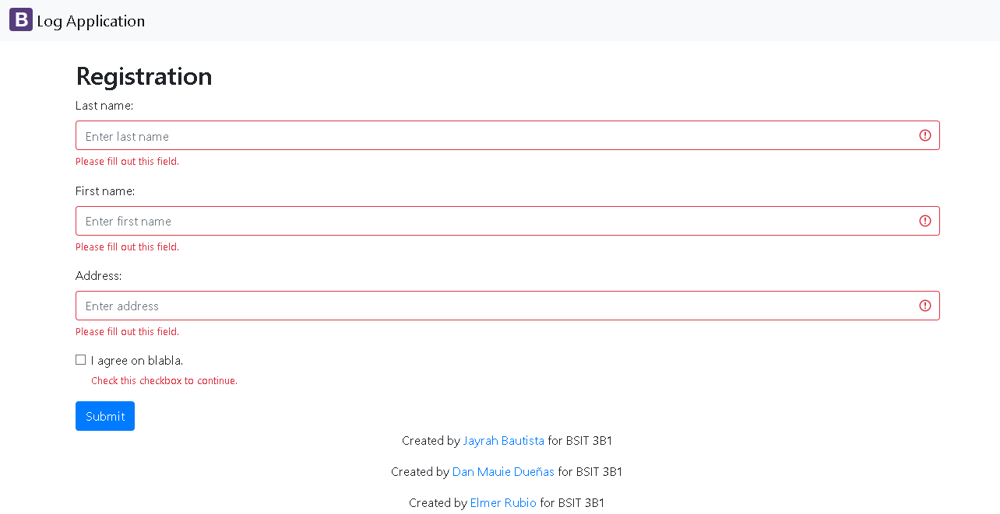
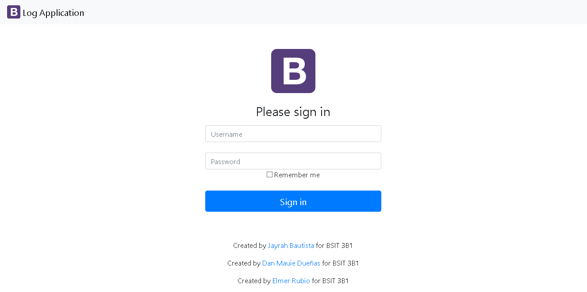
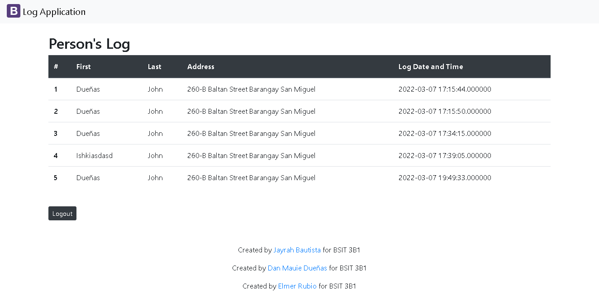

# logApp

**logApp** is an application that logs the individual's personal information such as their **name**, **address**, and the **date** and **time** he/she visits the place. This application functions similar to log books used on mall entrances.

Users with an **admin account** can view record entries of people who visited the premises. 
***
## Pages
### Guest Log Form

### Admin Log In

### Guest Book List

***
## Installation

1. Install a local web server that runs **Apache, phpMyAdmin, and MySQL**. Link: [WampServer](https://www.wampserver.com/en/ "WampServer Website").
2. Log into phpMyAdmin.
3. Create new database.
4. Import database / sql file (logappdb.sql).
5. Clone our remote repo to download our files. Link: [logApp](https://github.com/danmauie/logoApp-Duenas "logApp remote repo").
6. Copy folder to local host directory (wamp64/www/).
7. Run WampServer.
8. Open your preferred web browser and enter "**localhost**" in the URL bar.
9. Navigate to the logApp folder.

***
## Authors
* [Bautista, Jayrah](https://github.com/JayrahBautista "Jayrah's Github profile") 

* [Dueñas, Dan Mauie](https://github.com/danmauie "Mauie's Github profile") 

* [Rubio, Elmer](https://github.com/elmerrubiojr "Elmer's Github profile") 

